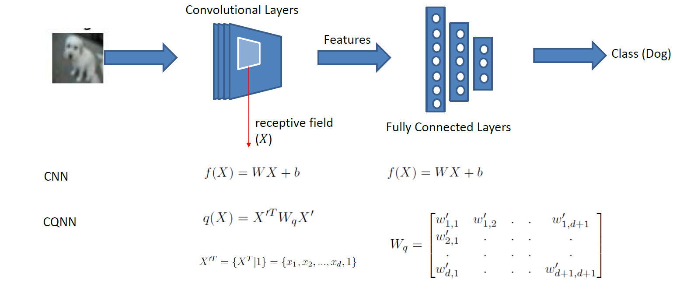

# CQNN
## CQNN: Convolutional Quadratic Neural Networks.

We define CQNNs, where the neurons in the convolutional layers of CNNs are replaced by quadratic neurons. CNNs in general
have convolutional layers for feature extraction, followed by dense (fully connected) layers for classification. To
create a CQNN, we replace the linear neurons in the convolutional layers with quadratic neurons. Note that the neurons in
the fully connected layers are left intact.

As shown in the figure, in CNNs the neurons compute the linear function f(x). In CQNNs, these are replaced with quadratic
neurons that compute function q(x) (quadratic form).

Please the ICPR publication [CQNN: Convolutional Quadratic Neural Networks](https://www.researchgate.net/publication/344636757_CQNN_Convolutional_Quadratic_Neural_Networks)
for details.

This sample code takes two well-known architectures: Alexnet and Resnet, and creates quadratic variants. The code can be
to train on two datasets Cifar10 and Cifar100

### Code & Files:
1. Application.py: The main file to run the training and testing
2. linear: This package has the linear variants of Alexnet and ResNet architectures.
3. quadratic: This package has the quadratic variants of the Alexnet and ResNet architectures.
4. quadratic/qconv2d.py: This module has the implementation of the quadratic convolutional layer. It takes as input a batch
  of images and computes the quadratic output.

### Requirements:
The code is tested in an Ubuntu (18.04) environment. The following software and modules are required (See requirements.txt)
1. Python 2.7
2. numpy 1.16.6
3. opencv-python 3.4.1.15
4. tensorflow-gpu 2.0.0
5. keras 2.3.0

### Installation:
Using virtual environment.
1. Create a virtual environent.
> \$ virtualvenv venv
2. Activate environment
> \$ source venv/bin/activate
3. Install packages
> \$ pip install -r requirements.txt

### Traininig & Evaluation:
1. To train a CNN variant (Linear convolutional layers) on the cifar100 dataset
  1. Alexnet
  > \$ python Application.py -d cifar100 -m alexnet -n linear
  2. Resnet
  > \$ python Application.py -d cifar100 -m resnet -n linear
2. To train a CQNN variant (Quadratic convolutional layers) on the cifar100 dataset
  1. Alexnet
  > \$ python Application.py -d cifar100 -m alexnet -n quadratic
  2. Resnet
  > \$ python Application.py -d cifar100 -m resnet -n quadratic

